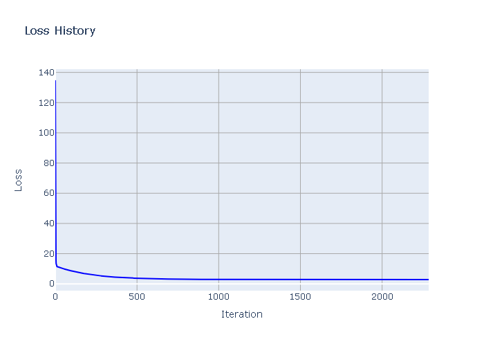
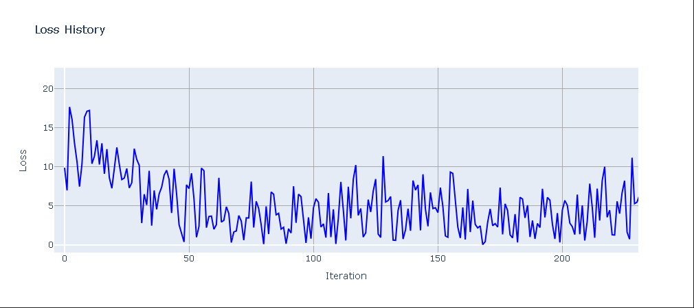
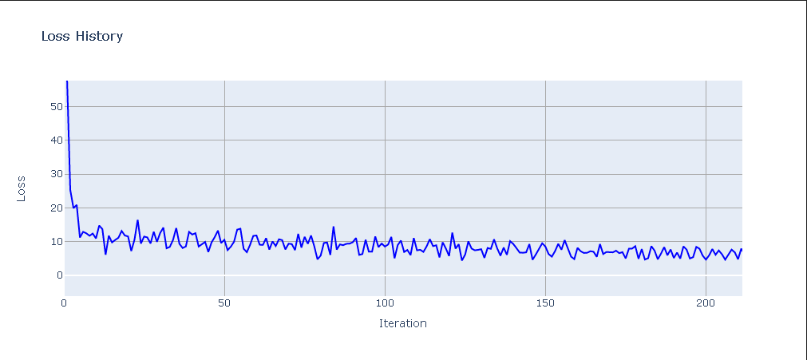

# Univariate Linear Regression with Gradient Descent Algorithms

In this project linear regression using three different gradient descent algorithms has been implemented: 
- **Batch Gradient Descent (BGD)**
- **Stochastic Gradient Descent (SGD)**
- **Mini-Batch Gradient Descent (MBGD)**

## 📚 Description
I recently completed the *Supervised Machine Learning: Regression and Classification* course on Coursera. To review my learning I prepared this notebook. In this notebook, I experimented with different parameters to observe how they affect the training process. Importantly, instead of relying on machine learning libraries, I implemented the mathematical formulas for each gradient descent algorithm which deepened my understanding of how these techniques work. The notebook includes interactive plots using `plotly` for better visualization.

## Dataset
The dataset is generated using random numbers. The data is univariate, meaning that it has only one feature (X) and one target variable (Y). The relationship between X and Y follows a linear pattern with some added noise.

## 📊 Results
#### 1. Loss History for Batch Gradient Descent (BGD)

BGD converges smoothly, indicating an effective path to the optimal solution. It could be slower for larger datasets since it processes all data points at each iteration.

#### 2. Loss History for Stochastic Gradient Descent (SGD)
The zoomed-in loss history plot for SGD:

We observe that the loss fluctuates more compared to BGD due to the weight updates happening after each data point. This fluctuation can be advantageous in finding an optimal solution faster; also needs a lower learning rate for better convergence.

#### 3. Loss History for Mini-Batch Gradient Descent (MBGD)
The zoomed-in loss history for MBGD:

The plot indicates that MBGD maintains a balance between the stability of BGD and the speed of SGD. It shows more consistent progress toward minimizing the loss, updating weights after processing smaller batches of data.

For a more detailed comparison of the model parameters during training, please refer to the notebook, where plots of the weight \( W \) and bias \( b \) histories are available.

## Prerequisites
- Python 3.x
- Required libraries: `numpy`, `pandas`, `matplotlib`, `seaborn`, `plotly`, and `logging`

